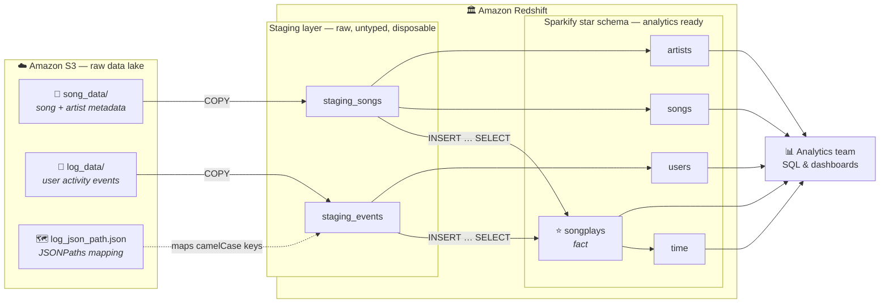
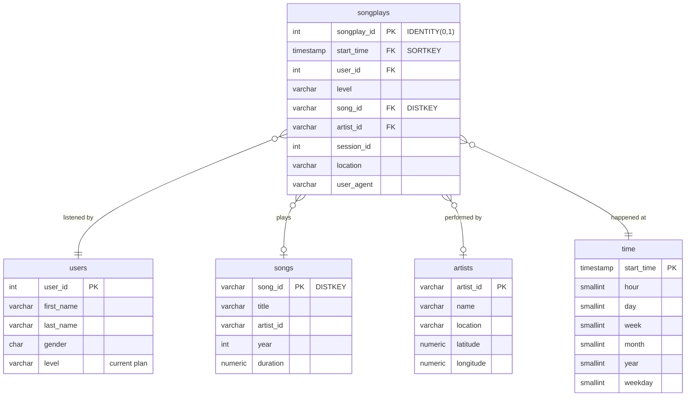

<h1 align="center">🎵 Sparkify Data Warehouse</h1>

<p align="center">
  <strong>An ETL pipeline that lifts a music streaming startup's raw JSON logs out of S3<br/>
  and lands them in an analytics-ready star schema on Amazon Redshift.</strong>
</p>

<p align="center">
  
  
  
  
  
</p>

---

## 📖 Table of Contents

| Section | What's in it |
| :--- | :--- |
| [Objective](#-objective) | The business problem and why a warehouse solves it |
| [Architecture](#-architecture) | How data moves from S3 to the star schema |
| [Source Data](#-source-data) | The raw datasets on S3 |
| [Database Design](#-database-design) | The star schema, and why it's shaped this way |
| [Redshift Optimisation](#-redshift-optimisation) | Distribution and sort key rationale |
| [ETL Pipeline](#-etl-pipeline) | The two phases, step by step |
| [Data Quality](#-data-quality) | The 22 checks that gate a successful load |
| [Repository Structure](#-repository-structure) | What every file does |
| [Getting Started](#-getting-started) | Setup and the full runbook |
| [Example Analytics](#-example-analytics) | Questions the warehouse answers |
| [Design Decisions & Trade-offs](#-design-decisions--trade-offs) | The interesting calls, and the alternatives |

---

## 🎯 Objective

**Sparkify** is a music streaming startup. Their user base and song catalogue have
both grown to the point where the old setup no longer keeps up, so they are moving
their data onto the cloud.

Today that data sits in S3 as two directories of raw JSON:

- **event logs** — every action a user takes in the app, one file per day
- **song metadata** — one file per song in the catalogue

Raw JSON on S3 is excellent for *storage* and terrible for *analysis*. Answering
something as simple as *"what was our most played song last week?"* means scanning
thousands of files, parsing every record, and joining two datasets that share no keys.
Nobody on the analytics team can do that in a dashboard.

**The goal of this project** is to close that gap: an ETL pipeline that

1. **extracts** the raw JSON from S3,
2. **stages** it in Redshift with a bulk parallel load,
3. **transforms** it into a dimensional model built for song play analysis,

so the analytics team can answer business questions with plain SQL — in seconds,
without ever touching a JSON file.

> [!NOTE]
> This is the *Data Warehouse* project of the Udacity **AWS Data Engineering** program.

---

## 🏗 Architecture



The pipeline is deliberately **two-hop** — S3 → staging → star schema — rather than
loading S3 straight into the dimensional model. That extra hop buys three things:

| Benefit | Why it matters |
| :--- | :--- |
| **Decoupling** | The staging tables are a contract-free copy of the raw logs. When the app team changes a log field, only the transform SQL changes — never the load. |
| **Speed** | `COPY` ingests in parallel across every slice of the cluster. Reshaping data afterwards is a set-based `INSERT … SELECT` that runs entirely inside Redshift, so warehouse data is never pulled down to the client. |
| **Debuggability** | When a number looks wrong, the raw input is still sitting in Redshift next to the output. You can diff them with SQL instead of re-downloading from S3 (`etl.py --skip-copy` re-runs only the transform). |

---

## 📦 Source Data

| Dataset | S3 path | Shape |
| :--- | :--- | :--- |
| **Song data** | `s3://udacity-dend/song_data` | A subset of the [Million Song Dataset](http://millionsongdataset.com/). One JSON object per file, one file per song, nested in directories by the first letters of the track ID. |
| **Log data** | `s3://udacity-dend/log_data` | Simulated activity logs from an [event simulator](https://github.com/Interana/eventsim). Newline-delimited JSON, one file per day. |
| **JSONPaths** | `s3://udacity-dend/log_json_path.json` | Maps the event log's `camelCase` keys onto the staging columns. |

<details>
<summary><strong>Why the event log needs a JSONPaths file (and the song data doesn't)</strong></summary>

<br/>

`COPY … FORMAT AS JSON 'auto'` matches JSON keys to column names **by name**. That
works perfectly for the song files, whose keys are already `snake_case`:

```json
{ "num_songs": 1, "artist_id": "ARJIE2Y1187B994AB7", "title": "Der Kleine Dompfaff" }
```

The event logs, however, use `camelCase` keys like `firstName`, `itemInSession` and
`userAgent`. Redshift column names are case-insensitive, so `firstName` would not
resolve to a distinct column. The JSONPaths file sidesteps the problem by mapping
**by position** instead:

```json
{ "jsonpaths": ["$['artist']", "$['auth']", "$['firstName']", "..."] }
```

**This makes column order load-critical.** If `staging_events` declares its columns in
a different order than the JSONPaths file lists them, the `COPY` still *succeeds* — it
just silently writes each value into the wrong column. That failure mode is nasty
enough that [`test_pipeline.py`](test_pipeline.py) asserts the order on every test run.

</details>

---

## 🗄 Database Design

The warehouse is a **star schema**: one central fact table surrounded by four
dimensions, each one join away.



### Why a star schema?

A normalised (3NF) model is the right choice when the priority is avoiding update
anomalies in a transactional system. Here the priority is the exact opposite: the
warehouse is **append-only and read-heavy**, and it exists to be queried by analysts.
So the design optimises for that:

- **Fewer joins.** Every dimension is exactly one hop from the fact table. *"Most played
  song by hour of day"* is a two-join query, not a six-join crawl through bridge tables.
- **Queries that read like the question.** `GROUP BY t.hour` is self-explanatory in a
  way that `EXTRACT(hour FROM …)` over a raw timestamp is not.
- **Cheap denormalisation.** Redshift is columnar, so the redundancy a star schema
  introduces compresses away to nearly nothing — while the join it saves is real.
- **BI-tool native.** Every dashboarding tool understands facts and dimensions.

### The grain

> **One row in `songplays` = one song play by one user at one point in time.**

Everything follows from that sentence. It's why the fact table is driven by the event
log filtered to `page = 'NextSong'` (the only page that represents an actual play), and
why `songs` and `artists` are joined in as *attributes* of a play rather than driving
the query themselves.

### The `time` dimension is derived from the fact table

`time` is populated from `SELECT DISTINCT start_time FROM songplays` rather than from
`staging_events`. This makes it a **conformed dimension** with no orphan rows: every
timestamp in `time` corresponds to a real play, and every play's timestamp is in `time`.
Building it from the staging table instead would include timestamps from non-play
events (logins, page views, upgrades) that no fact row references.

The trade-off is an **ordering dependency** — `songplays` must be loaded before `time`.
That's encoded in `insert_table_queries`, and asserted by a test.

---

## ⚡ Redshift Optimisation

Redshift is a **massively parallel, columnar** database. Getting good performance out
of it is largely about one question: *when two tables are joined, does the data already
live on the same node?* If not, Redshift has to redistribute or broadcast rows over the
network first — usually the single most expensive step in a query.

### Distribution strategy

| Table | Rows | Strategy | Reasoning |
| :--- | ---: | :--- | :--- |
| `songplays` | ~6.8 K | `DISTKEY(song_id)` | The fact table's most expensive join is `songplays → songs`. |
| `songs` | ~14.9 K | `DISTKEY(song_id)` | Sharing the fact table's key makes that join **local to each slice** — zero data movement. Too large to replicate comfortably. |
| `users` | ~104 | `DISTSTYLE ALL` | Tiny. Replicating it to every node removes the broadcast step from every join it takes part in, at negligible storage cost. |
| `artists` | ~10 K | `DISTSTYLE ALL` | Small and narrow — replication is still much cheaper than redistributing on every query. |
| `time` | ~6.8 K | `DISTSTYLE ALL` | Joined by nearly every time-series query; replication makes those joins free. |
| `staging_*` | — | `DISTSTYLE EVEN` | Landing zones. No joins happen here, so the only goal is spreading rows evenly to keep `COPY` fast. |

> [!TIP]
> `songplays` and `songs` sharing `song_id` is the single most consequential decision
> in the schema. It is what turns the fact-to-song join from a network operation into a
> local one.

### Sort keys

Sort keys let Redshift skip whole blocks of data it knows can't match a filter.

- **`songplays.start_time`** and **`time.start_time`** — almost every analytical query
  filters or groups by time ("last week", "by hour"), so time is the natural sort order.
- **`users.user_id`**, **`artists.artist_id`**, **`songs.artist_id`** — sorted on the
  column they are most often joined or filtered on.

### `VACUUM` and `ANALYZE`

The `COPY` statements deliberately run with `COMPUPDATE OFF` and `STATUPDATE OFF` to
keep the load fast. The cost of that speed is tables that are left unsorted with stale
statistics — which would give the query planner bad row estimates and, in turn, bad
join plans. `etl.py` therefore runs `VACUUM` and `ANALYZE` once at the end of the load,
which is far cheaper than having `COPY` maintain both incrementally.

---

## 🔄 ETL Pipeline

### Phase 1 — Extract & Load (S3 → staging)

Two `COPY` statements, one per dataset. `COPY` is the only sane way to ingest at this
volume: it reads from S3 **in parallel across every slice** of the cluster, whereas
row-by-row `INSERT`s would funnel every record through the leader node.

```sql
COPY staging_events
FROM 's3://udacity-dend/log_data'
IAM_ROLE '<arn>'
REGION 'us-west-2'
FORMAT AS JSON 's3://udacity-dend/log_json_path.json'
BLANKSASNULL EMPTYASNULL COMPUPDATE OFF STATUPDATE OFF;
```

`BLANKSASNULL` and `EMPTYASNULL` matter more than they look: the event logs use empty
strings for missing values, and without these flags `userId` would arrive as `''`
rather than `NULL`, quietly breaking the not-null filter downstream.

### Phase 2 — Transform (staging → star schema)

Five `INSERT … SELECT` statements, run in dependency order. Each one handles
duplicates in the way that's correct *for that table* — which is different in every
case:

<table>
<tr><th>Table</th><th>Deduplication strategy</th><th>Why this one</th></tr>
<tr>
  <td><code>songplays</code></td>
  <td><code>LEFT JOIN</code> on title + artist + duration</td>
  <td>
    The grain is the event, so the event log drives the query and the song metadata is
    <em>joined in</em>. The join must be a <strong>LEFT</strong> join: the song dataset
    is only a subset of the catalogue, so most plays have no matching song — and a play
    with an unknown song is still a play. Matching on title and artist name alone is
    ambiguous for live versions and re-releases, so <code>duration</code> breaks the tie
    with a 2-second tolerance to absorb rounding differences between the datasets.
  </td>
</tr>
<tr>
  <td><code>users</code></td>
  <td><code>ROW_NUMBER() … ORDER BY ts DESC</code></td>
  <td>
    A user appears once per event, and <strong>their subscription level changes over
    time</strong>. A plain <code>DISTINCT</code> would emit one row per (user, level)
    pair — the same user twice. Keeping only the most recent event per user makes
    <code>level</code> mean "current plan", which is what an analyst assumes it means.
  </td>
</tr>
<tr>
  <td><code>songs</code></td>
  <td><code>SELECT DISTINCT</code></td>
  <td>
    A <code>song_id</code> always carries identical attributes across files, so plain
    <code>DISTINCT</code> is sufficient — no window function needed.
  </td>
</tr>
<tr>
  <td><code>artists</code></td>
  <td><code>ROW_NUMBER()</code> ranked by completeness</td>
  <td>
    Unlike songs, the same <code>artist_id</code> arrives with <em>different</em>
    location and coordinates — many song files leave them blank. <code>DISTINCT</code>
    would produce several rows per artist and break the primary key. The window function
    picks the <strong>richest</strong> record: the one that actually has coordinates and
    a location.
  </td>
</tr>
<tr>
  <td><code>time</code></td>
  <td><code>SELECT DISTINCT start_time FROM songplays</code></td>
  <td>
    Derived from the fact table, so the dimension contains exactly the timestamps
    <code>songplays</code> references — no orphans, no unreferenced rows.
  </td>
</tr>
</table>

### Expected result

A successful run against the full dataset produces:

| Table | Rows |
| :--- | ---: |
| `staging_events` | 8,056 |
| `staging_songs` | 14,896 |
| `songplays` | 6,820 |
| `users` | 104 |
| `songs` | 14,896 |
| `artists` | 10,025 |
| `time` | 6,813 |

<details>
<summary><strong>Reading these numbers as a sanity check</strong></summary>

<br/>

The relationships between these counts are as informative as the counts themselves:

- **8,056 → 6,820**: the drop is the `page = 'NextSong'` filter. The other ~1,200 events
  are logins, page views, upgrades and downgrades — real user activity, but not *plays*.
- **`songs` == `staging_songs` (14,896)**: every song file describes a unique song, so
  deduplication changes nothing here. If these two numbers ever diverge, the song
  dataset has gained duplicates.
- **10,025 artists for 14,896 songs**: artists genuinely repeat across songs. This is
  the ratio that makes the `ROW_NUMBER()` deduplication necessary.
- **6,813 timestamps for 6,820 plays**: seven pairs of plays share a timestamp to the
  second — different users listening simultaneously. This is exactly why `time` is
  loaded with `DISTINCT` and keyed on `start_time`.

</details>

---

## ✅ Data Quality

A load that "ran without errors" is not the same as a load that produced trustworthy
data. `quality_checks.py` runs **22 assertions** after every ETL run and exits non-zero
if any fail, so it can gate a downstream job.

| Family | Checks |
| :--- | :--- |
| **Completeness** | Every one of the 7 tables has at least one row. A silently failed `COPY` shows up here as an empty staging table. |
| **Integrity — keys** | Primary keys are unique on all 5 warehouse tables; `songplays.start_time` and `user_id` are never null. |
| **Integrity — referential** | Redshift does not enforce foreign keys, so they are verified explicitly: every `user_id` and `start_time` in the fact table resolves, and every *matched* `song_id` / `artist_id` exists in its dimension. |
| **Correctness** | `songplays` row count equals the number of `NextSong` events in staging — proof the fact table neither dropped nor duplicated rows during the join. |
| **Plausibility** | `level` ∈ {`free`, `paid`}, `hour` ∈ 0–23, `weekday` ∈ 0–6, durations non-negative, coordinates within valid lat/long bounds. |

> [!IMPORTANT]
> The referential checks deliberately allow `songplays.song_id` to be `NULL` — that's the
> expected state for a play whose song isn't in the metadata subset. They only assert that
> a *non-null* key resolves. Asserting no nulls would fail on correct data.

On top of that, `test_pipeline.py` runs **23 offline tests** that need no AWS account at
all, catching the failure modes that would otherwise appear thirty minutes into a load:
JSONPaths column-order drift, unresolved f-string placeholders in a `COPY`, a table
created but never dropped, or the `songplays`-before-`time` ordering being broken.

---

## 📁 Repository Structure

```
aws_data_engineering/
├── iac.py               # 🏗  Provision / inspect / tear down the AWS infrastructure
├── create_tables.py     # 🔨  Drop and recreate the staging tables + star schema
├── etl.py               # 🔄  The pipeline: COPY from S3, then transform into the star schema
├── sql_queries.py       # 📝  Every SQL statement, grouped by pipeline stage
├── quality_checks.py    # ✅  22 post-load assertions on the warehouse
├── analytics.py         # 📊  Run the example business questions and print a report
├── utils.py             # 🔧  Shared config loading, connection and timed execution
├── test_pipeline.py     # 🧪  23 offline tests — no AWS account required
├── dwh.cfg              # ⚙️   Configuration template (fill in before running)
├── requirements.txt     # 📦  Python dependencies
└── README.md            # 📖  You are here
```

| File | Responsibility |
| :--- | :--- |
| [`sql_queries.py`](sql_queries.py) | The single source of truth for SQL. Statements are grouped into `drop_`, `create_`, `copy_`, `insert_` and `analytic_queries` lists, which keeps every other script a thin orchestrator with no embedded SQL of its own. |
| [`utils.py`](utils.py) | Config loading, the Redshift connection, and timed query execution. Fails fast with an actionable message when the config is still blank, instead of hanging on a connection to `""`. |
| [`create_tables.py`](create_tables.py) | Drops and recreates the whole schema. Idempotent, so it's safe to re-run whenever you want to reset the warehouse. |
| [`etl.py`](etl.py) | The pipeline. `--skip-copy` re-runs only the transform (handy while iterating on the `INSERT`s), `--skip-checks` skips the quality gate. |
| [`quality_checks.py`](quality_checks.py) | The post-load quality gate. Also importable, which is how `etl.py` runs it automatically. |
| [`analytics.py`](analytics.py) | Runs the example questions. `--markdown` emits tables ready to paste straight into this README. |
| [`iac.py`](iac.py) | Infrastructure as code: `create`, `status`, `delete`. Writes the resulting endpoint and role ARN back into `dwh.cfg` automatically. |

---

## 🚀 Getting Started

### Prerequisites

- Python 3.9 or newer
- An AWS account, plus an IAM user with permission to manage Redshift, IAM and EC2
  security groups

### 1. Install

```bash
git clone <this-repo>
cd aws_data_engineering

python -m venv .venv
source .venv/bin/activate          # Windows: .\.venv\Scripts\Activate.ps1

pip install -r requirements.txt
```

### 2. Configure

Fill in the blanks in [`dwh.cfg`](dwh.cfg):

```ini
[AWS]
KEY    = <your-access-key-id>
SECRET = <your-secret-access-key>

[CLUSTER]
DB_PASSWORD = <8-64 chars, with an uppercase, a lowercase and a digit>
```

`HOST` and `ARN` are left blank on purpose — `iac.py create` fills them in for you.

> [!CAUTION]
> **Never commit a filled-in `dwh.cfg`.** The version in this repo is a template with
> empty credentials. Keep your real values in `dwh.local.cfg` (already git-ignored) and
> point any script at it with `--config dwh.local.cfg`.

### 3. Run the pipeline

```bash
python iac.py create          # ~5 min: IAM role + Redshift cluster, writes HOST and ARN
python create_tables.py       # drop and recreate the schema
python etl.py                 # load S3 → staging → star schema, then run quality checks
python analytics.py           # print the song play analytics report
python iac.py delete          # ⚠️ tear it all down so it stops costing money
```

Each script is independent and re-runnable, so you can iterate on any single stage:

```bash
python etl.py --skip-copy               # re-run only the transform
python quality_checks.py                # re-run only the quality gate
python analytics.py --markdown          # emit report tables as Markdown
python iac.py status                    # what state is the cluster in?
python iac.py delete --keep-role        # drop the cluster, keep the IAM role
python -m unittest discover -v          # the 23 offline tests, no AWS needed
```

> [!WARNING]
> **Redshift bills by the hour, whether or not you're querying it.** A 4-node
> `dc2.large` cluster is not free. Run `python iac.py delete` as soon as you're done,
> and confirm in the AWS console that the cluster is actually gone.

<details>
<summary><strong>Troubleshooting</strong></summary>

<br/>

Most problems on this project are **security and networking**, not SQL.

| Symptom | Likely cause |
| :--- | :--- |
| Connection hangs, then times out | The cluster's security group has no inbound rule for port 5439. `iac.py create` adds one — if you built the cluster by hand, add it yourself. Also check the cluster is *publicly accessible*. |
| `S3ServiceException: Access Denied` during `COPY` | The IAM role in `[IAM_ROLE] ARN` is missing `AmazonS3ReadOnlyAccess`, or is not attached to the cluster. |
| `COPY` fails with a length error | A source value exceeds its staging column width. Widen the column in `sql_queries.py`, or inspect `stl_load_errors` for the offending row. |
| `Missing [CLUSTER] settings` | `dwh.cfg` is still a blank template. Run `iac.py create`, or fill in `HOST` and `DB_PASSWORD` by hand. |
| Cluster region mismatch | `[DWH] REGION` must match the region the S3 bucket lives in (`us-west-2` for `udacity-dend`). Cross-region `COPY` is slow at best. |

To see why a `COPY` failed, ask Redshift directly:

```sql
SELECT starttime, filename, line_number, colname, err_reason
FROM stl_load_errors
ORDER BY starttime DESC
LIMIT 10;
```

</details>

---

## 📊 Example Analytics

The point of the whole exercise. Each of these is a short SQL query against the star
schema — the kind of thing that was effectively impossible against raw JSON on S3.
All seven live in `sql_queries.analytic_queries` and are run by `python analytics.py`.

| # | Question | Business value |
| :-- | :--- | :--- |
| 1 | Which songs are played the most? | Editorial playlists, licensing priorities |
| 2 | Which artists are played the most? | Artist partnerships and promotion |
| 3 | What are the peak listening hours? | Capacity planning, campaign scheduling |
| 4 | Where are our listeners? | Regional marketing, CDN placement |
| 5 | How does engagement differ between paid and free users? | Conversion and pricing strategy |
| 6 | Who are our most active users? | Power-user research, churn risk |
| 7 | Weekdays or weekends? | Content release timing |

**Peak listening hours** — a two-join query, thanks to the pre-computed `time` dimension:

```sql
SELECT t.hour                       AS hour_of_day,
       COUNT(*)                     AS plays,
       COUNT(DISTINCT sp.user_id)   AS distinct_listeners
FROM songplays sp
JOIN time t ON t.start_time = sp.start_time
GROUP BY t.hour
ORDER BY plays DESC;
```

**Free vs. paid engagement** — one table, and it immediately quantifies how much more
paid users listen:

```sql
SELECT sp.level                                     AS subscription,
       COUNT(*)                                     AS plays,
       COUNT(DISTINCT sp.user_id)                   AS users,
       ROUND(COUNT(*)::NUMERIC
             / COUNT(DISTINCT sp.user_id), 1)       AS plays_per_user
FROM songplays sp
GROUP BY sp.level
ORDER BY plays DESC;
```

**Most played songs** — the query that motivated the `DISTKEY(song_id)` choice, since
it joins the fact table to both `songs` and `artists`:

```sql
SELECT s.title    AS song,
       a.name     AS artist,
       COUNT(*)   AS plays
FROM songplays sp
JOIN songs   s ON s.song_id   = sp.song_id
JOIN artists a ON a.artist_id = sp.artist_id
GROUP BY s.title, a.name
ORDER BY plays DESC
LIMIT 10;
```

> [!TIP]
> Run `python analytics.py --markdown` after a load to generate these tables with your
> own results, ready to paste back into this file.

---

## 🤔 Design Decisions & Trade-offs

<details open>
<summary><strong>Why stage the data instead of loading S3 straight into the star schema?</strong></summary>

<br/>

It would be possible to write the star schema directly from S3, but the staging layer
pays for itself: it decouples the warehouse from the raw log format, lets the transform
run as fast set-based SQL inside Redshift, and leaves the raw input sitting next to the
output for debugging. The cost is transient storage that `create_tables.py` reclaims on
the next run.

</details>

<details>
<summary><strong>Why <code>LEFT JOIN</code> for the song lookup instead of an inner join?</strong></summary>

<br/>

The song dataset is only a *subset* of the real catalogue, so the large majority of
plays have no matching song. An inner join would silently discard them and shrink the
fact table by an order of magnitude — the analytics team would be computing engagement
metrics on a small, biased sample without knowing it. A play whose song isn't in the
metadata is still a play; it just has a `NULL` `song_id`. The quality checks are written
to expect that.

</details>

<details>
<summary><strong>Why is a 2-second tolerance used on <code>duration</code>?</strong></summary>

<br/>

Title and artist name alone are ambiguous — live versions, remasters and re-releases
share both. Adding `duration` as a tie-breaker disambiguates them, but the two datasets
round durations differently, so an exact match would reject valid pairs. Two seconds is
wide enough to absorb the rounding and narrow enough to separate genuinely different
recordings.

</details>

<details>
<summary><strong>Why <code>IDENTITY(0,1)</code> instead of <code>SERIAL</code>?</strong></summary>

<br/>

`SERIAL` is PostgreSQL syntax and **is not supported by Redshift**, even though Redshift
speaks the PostgreSQL wire protocol. `IDENTITY(0,1)` is the Redshift equivalent. Note
that identity values are guaranteed unique but *not* gap-free — they're allocated per
slice, so treat `songplay_id` as a surrogate key, never as a row counter.

</details>

<details>
<summary><strong>Why does the connection run in autocommit?</strong></summary>

<br/>

Wrapping a whole load in one transaction sounds safer, but it means a failure in the
last `INSERT` rolls back forty minutes of `COPY` work. With autocommit, each statement
stands alone: a mid-pipeline failure leaves the already-loaded tables intact, so
`--skip-copy` can resume from the transform instead of re-ingesting from S3.

</details>

<details>
<summary><strong>Why keep the credentials out of <code>dwh.cfg</code>?</strong></summary>

<br/>

A committed `dwh.cfg` with live AWS keys is a real security incident, and git history
makes it permanent — rotating the key is the only fix. The template ships blank,
`dwh.local.cfg` is git-ignored, and every script takes `--config` so the real values
never need to sit in a tracked file.

</details>

<details>
<summary><strong>What would change at 1000× the data volume?</strong></summary>

<br/>

The design holds, but three things would need attention: `DISTSTYLE ALL` on `artists`
would stop being cheap and should move to `DISTKEY(artist_id)`; the daily log files
should be loaded incrementally by date prefix rather than re-copying the whole bucket;
and `songplays` would want a compound sort key on `(start_time, song_id)` so the
time-range filter and the song join can both use zone maps.

</details>

---

<p align="center">
  <sub>Built as part of the Udacity <strong>AWS Data Engineering</strong> Nanodegree ·
  Data Warehouse project</sub>
</p>
